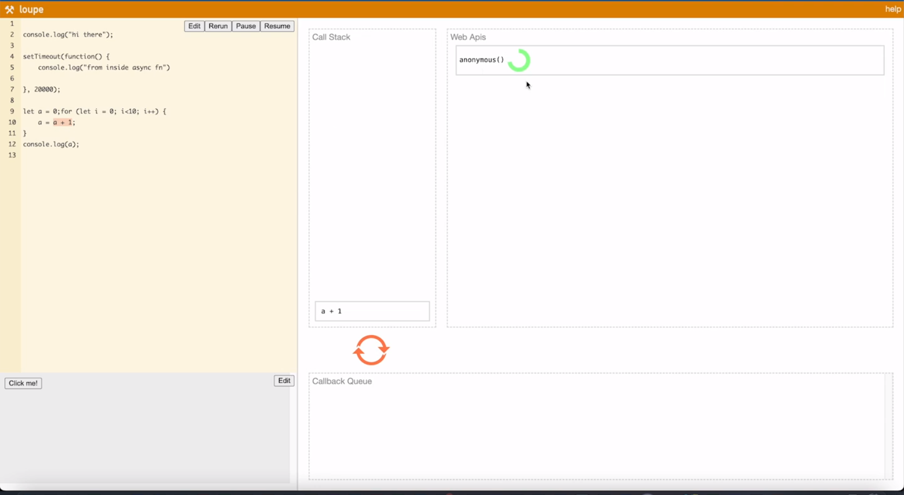
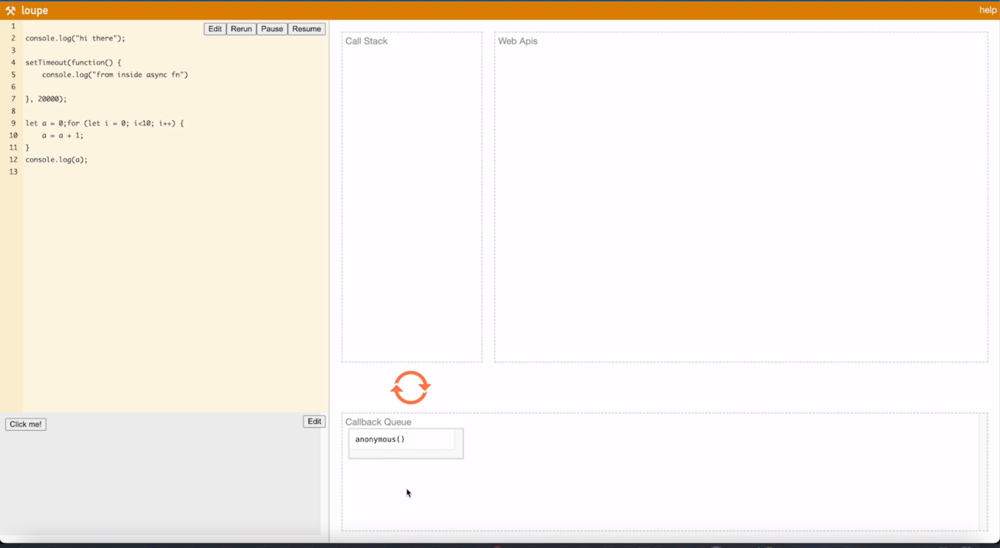
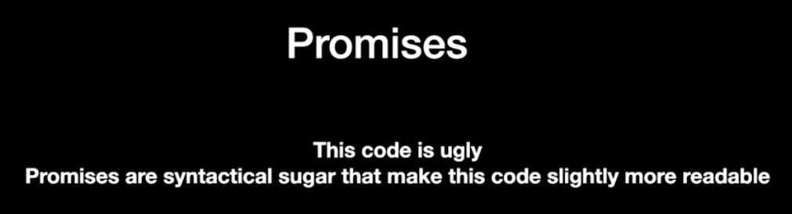
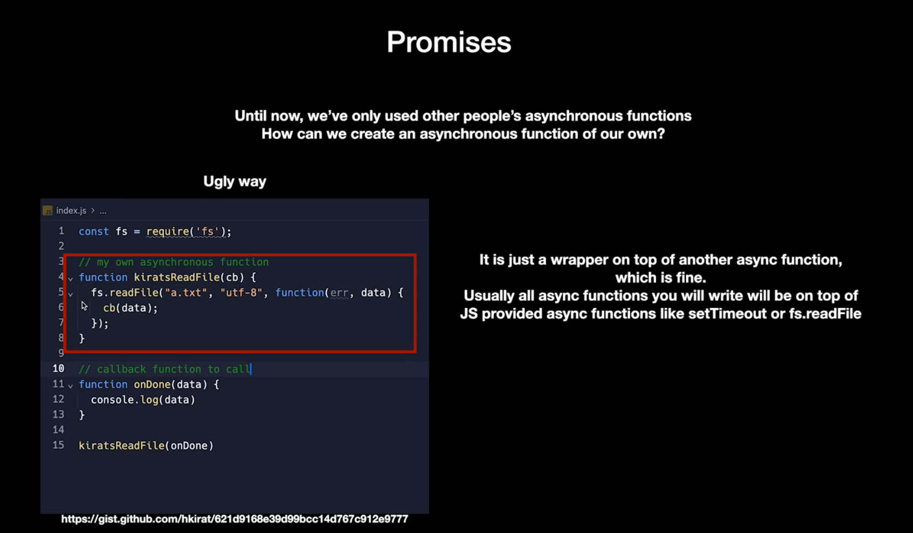
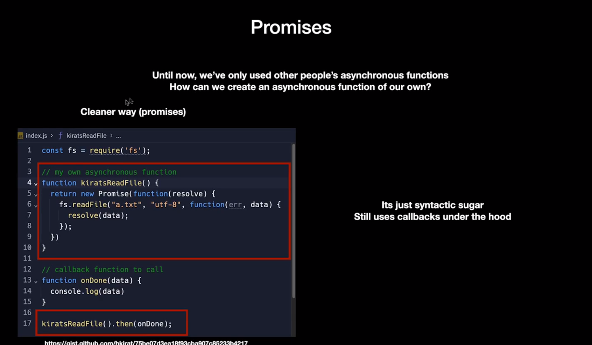
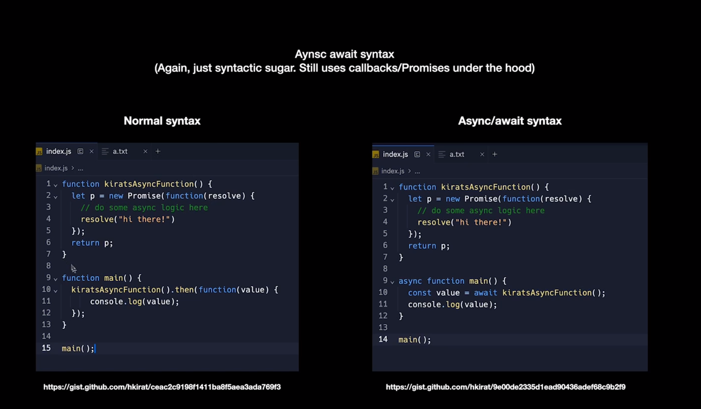
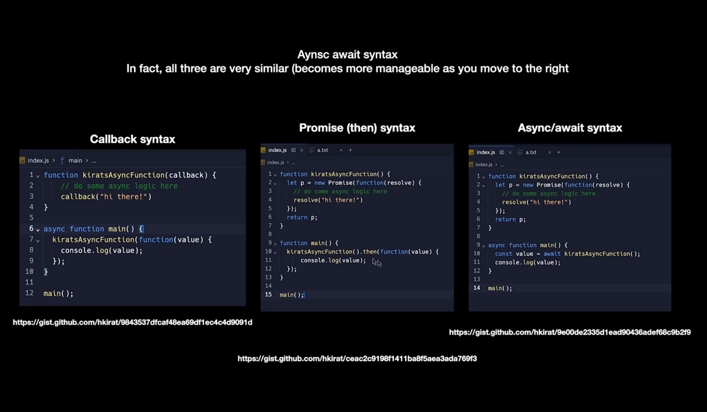

the call stack is the currently running process
web apis is the functions added on top of node by web that keeps on running/waiting while the time duration
callback queue stores the function after completion that the web apis was running 

promises

use of await solves the problem I wa sencountering in the hasjtag finder app

