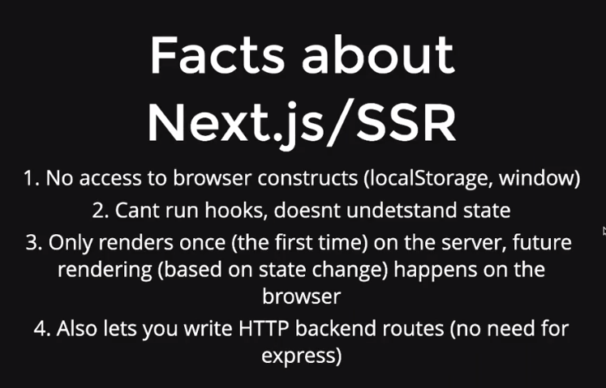
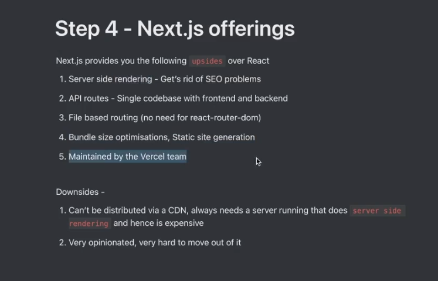
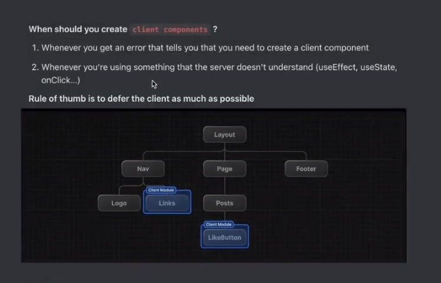

# NEXT.JS





getting started 
npx create-next-app@latest


in the files you want to use the client side (The server doesn't understand) example onClick

use 
```javascript
"use client"
```
This means the client component should be as low as possible in the tree


If you want to fetch data in a componenet make it async and use await.

If you know there will be a time delay add a loading.tsx with the page.tsx, so that it will be loaded till the page renders.


To fetch data from the backend thw wrong way for next

```typescript
"use client"
import axios from "axios";
import {useState, useEffect} from "react";

```

The next way for just fetch data in case of req with body use the old way

```typescript
async function fetchData() {
    const resp = await axios.get("");
    return resp.data;
}

export default async function User() {
    const data = await fetchData();


}
```

even better is not to fetch using http from the server to the server while not using "use client" is to directly call prisma from here

```typescript
async function fetchData() {
    // prisma logic
}

export default async function User() {
    const data = await fetchData();


}
```

when using prisma client like this in development
more detail [here](https://www.prisma.io/docs/orm/more/help-and-troubleshooting/help-articles/nextjs-prisma-client-dev-practices)
```ts
const client = new PrismaClient();
```
this make multiple instances for the client

```ts
import { PrismaClient } from '@prisma/client'

const prismaClientSingleton = () => {
  return new PrismaClient()
}

declare global {
  var prismaGlobal: undefined | ReturnType<typeof prismaClientSingleton>
}

const prisma = globalThis.prismaGlobal ?? prismaClientSingleton()

export default prisma

if (process.env.NODE_ENV !== 'production') globalThis.prismaGlobal = prisma
```
store this in a global db.ts file

use like this

```typescript
// e.g. in `pages/index.tsx`
import prisma from './db'

export const getServerSideProps = async () => {
  const posts = await prisma.post.findMany()

  return { props: { posts } }
}
```


## Important

To make a call again like signin you will sen http from sderver to server which is not sufficient

make a folder actions
and transfer the function isside files int his

still a request is sent but not using axios and can be simply used like a function

need to specify 

"use server"

as this will be called in the "use client"

so the browser should be told explicitly that this is a serever funcion