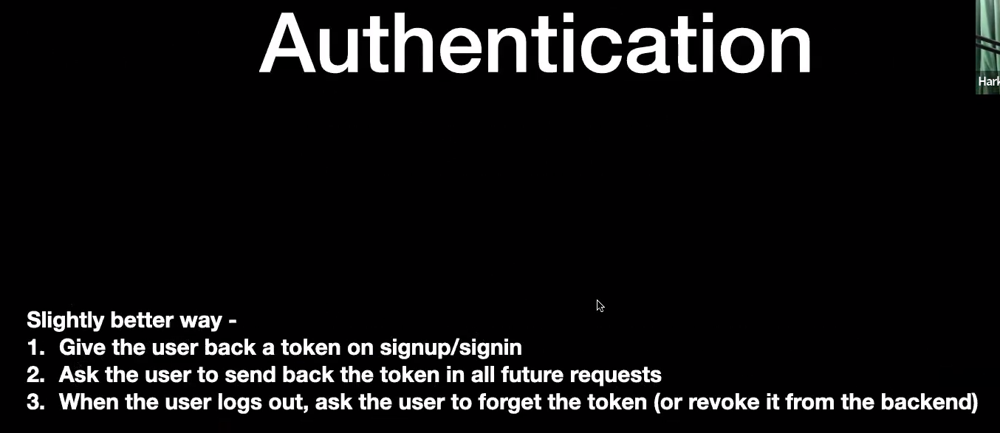

app.use(func)

these are the middle ware applied to all the requests

- The without middleware as the name suggests use no middle ware logic so we have to create multiple repeatitions of the same code.
- the withmiddleare uses zod and some basic middleware
- the totalmiddleware uses the best practices bearer token

the request can have multiple functions in it just canm be chained using next

        app.get('/', function(req, res) {
            //to transfer
            next();
        }, function(req , res) {
            //something
        });

There are  types of middlewares:
- auth
- count requests
- validate input(zod)
- global catches

        app.use(err, req, res, next) {
            res.json({
                msg: "Something went wrong"
            });
        };

if error in any request this will get called