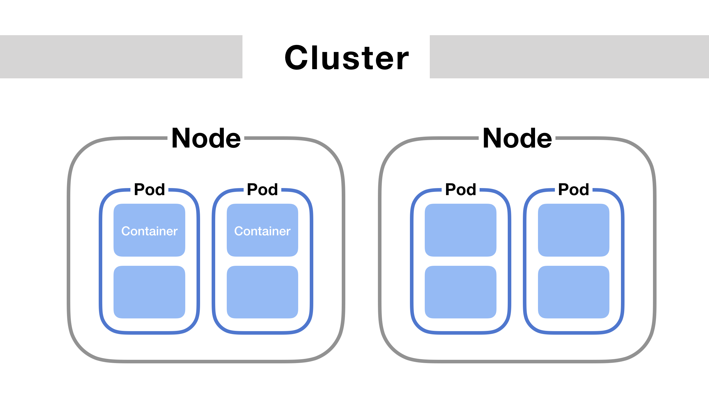
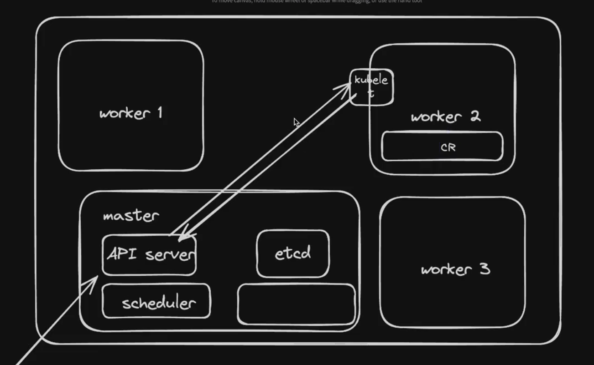

group of machines cluster
masters, workers


Node/Server
    Pod
  Cluster





to test kubernetes

- install kind(kubernetes in docker)
- to interact using command line to the master node use kubectl
- helps automate credentials send 

- kind create cluster --name local

cluster.yml
```yml
kind: Cluster
apiVersion: kind.x-k8s.io/v1alpha4
nodes:
- role: control-plane
- role: worker
- role: worker
```

- kind create cluster --config clusters.yml --name local

credentials
- cat ~/.kube/config

- kubectl get nodes

for this example I will use nginx 
docker run -p 3000:80 nginx
routes 3000 from host to container's 80

make a pod using kubectl
- kubectl run nginx --image=nginx --port=80

for logs 
- kubectl get pod
- kubectl logs nginx
- kubectl get pods -w

can also be created using this using manifest

manifest
```yml
apiVersion: v1
kind: Pod
metadata:
  name: nginx
spec:
  containers:
  - name: nginx
    image: nginx
    ports:
    - containerPort: 80
```
- kubectl apply -f manifest.yml